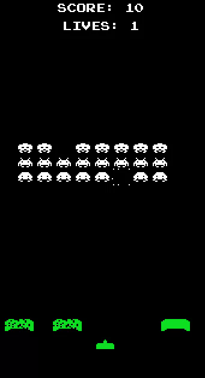

<h1 align="center">Space Invaders</h1>

# Space Invaders: Retornando aos Anos 70 🚀🕹️

Bem-vindo ao meu jogo de Space Invaders, uma viagem de volta aos dias dourados dos arcades, dos penteados extravagantes e das calças boca de sino! Prepare-se para uma aventura no espaço sideral com uma pitada de nostalgia! 🌌👾

## Instruções para Viajar no Tempo 🌀⏰

Para experimentar este incrível resgate dos anos 70:

1. Clone este repositório na sua máquina do tempo.
2. Este projeto foi desenvolvido com Godot Engine 2
3. Caso não possua, faça o Download aqui [Godot 2.1.2](https://godotengine.org/download/archive/2.1.2-stable/)
4. Inicia a Godot e importe seu projeto
5. Clique no botão play 🎮
6. Mova a nave com as teclas A e D e dispare com a tecla 2 do teclado numérico 💥🕹️

## Características Espaciais 🌟👽

- Gráficos retrô pixelados
- Efeitos sonoros nostálgicos
- Invaders de outro mundo 🛸👾

## Estrutura Galáctica do Projeto 🌠🛸

/  
|-- /samples # Sons espaciais  
|-- /scenes # As cenas e objetos principais do game  
|-- /scripts # Scripts alienígenas  
|-- /sprites # Sprites de outro mundo  
|-- ...

## Seja um Tripulante! 🚀👨‍🚀

Se você tiver ideias para melhorar esta viagem no tempo, faça um pull request e junte-se à nossa tripulação de desenvolvedores!

## Licença para Explorar 📜🌌

Este jogo está sob a licença MIT. Veja mais detalhes no arquivo `LICENSE`.

## Entre em Contato com a Base Espacial 📡🛸

Se tiver perguntas sobre a navegação no espaço ou se quiser compartilhar suas experiências na galáxia, envie um sinal de rádio para tiagolemespalhano@gmail.com ou nos encontre aqui no Github, próximo à Via Láctea!

Vamos embarcar nesta aventura espacial rumo aos anos 70! Pegue sua nave e junte-se à diversão intergaláctica! 🚀🌌🕹️

    

